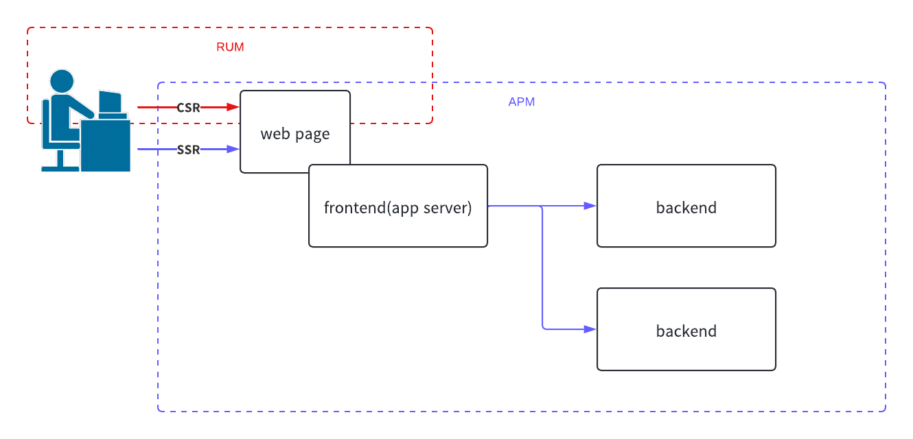

# README

## intro

This repository is a repository for integrating grafana Faro into a sandbox application written using next.js to validate RUM (real time user monitoring).

## configuration

```terminal:terminal
$docker-compose up --build
```

## architecture


## dashboard


ref: [https://grafana.com/grafana/dashboards/17766-frontend-monitoring/](https://grafana.com/grafana/dashboards/17766-frontend-monitoring/)

## explanation

### RUM vs APM

#### boundary line

TBU



#### Comparison of RUM and APM

TBU

#### Metrics that can be obtained with RUM

TBU

### What I consider to be best practices for RUM

TBU
